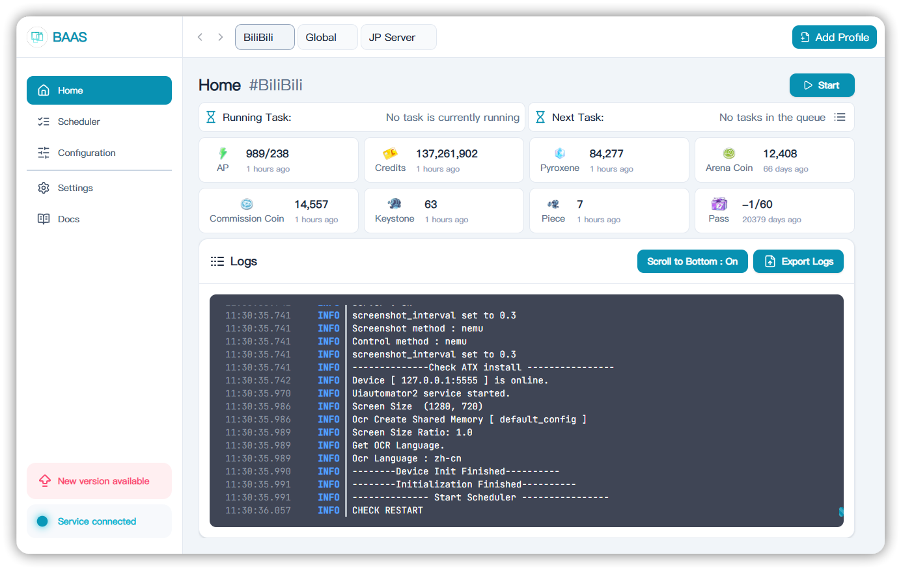
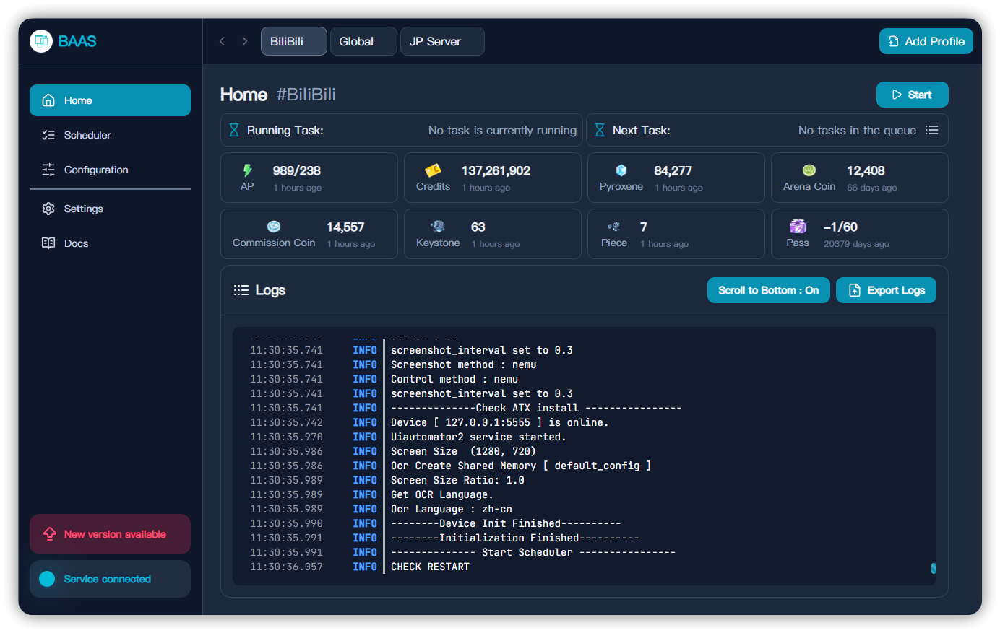

<div align="center">
<h1> 🌌 Blue Archive Auto Script GUI For Web </h1>

*Automation command center for multi-profile Blue Archive orchestration*

[](https://react.dev/) [](https://tailwindcss.com/) [](#-contributing) []() [](https://www.gnu.org/licenses/gpl-3.0)
</div>
---

| ☀️ Light Mode | 🌙 Dark Mode |
|:--:|:--:|
|  |  |


## 🚀 Overview

BlueArchive Auto Script GUI is a React-driven desktop dashboard that wraps the Blue Archive automation core with a polished, responsive control surface. It keeps pilots in control of multi-instance farming by blending real-time telemetry, drag-and-drop scheduling, and richly localized documentation in one place.

Under the hood the app binds secure WebSocket channels (`provider`, `sync`, `trigger`, `heartbeat`) to a local automation service, persists UI preferences, and renders fine-grained configuration panels for every daily activity — from cafés and arenas to tactical drills and whitelist management.

```
✨ Multi-profile orchestration with drag-to-reorder tabs  
⚡ Real-time task queue and log streaming over secure WebSockets  
🧠 Built-in multilingual wiki (EN/JA/KO/ZH/RU/FR/DE) with syntax-highlighted guides  
🧩 Modular configuration modals for every automation domain  
```

---

<details open>
<summary><b>📑 Table of Contents</b></summary>

<div style="text-align: left">

| Section                                    | Description                             |
|:-------------------------------------------|:----------------------------------------|
| [🚀 Overview](#-overview)                  | Project summary & key features          |
| [🏗️ Architecture](#-architecture)         | Structural design and workflow          |
| [⚙️ Installation](#-installation)          | Setup instructions and environment      |
| [🧩 Usage](#-usage)                        | How to run and interact with the system |
| [🛠️ Configuration](#-configuration)       | Customization and environment variables |
| [🧠 Tech Stack](#-tech-stack)              | Frameworks, libraries, and tools        |
| [🗂️ Folder Structure](#-folder-structure) | Directory layout and file roles         |
| [📸 Visuals](#-visuals)                    | UI previews and architecture diagrams   |
| [🤝 Contributing](#-contributing)          | Guidelines for contributors             |
| [📜 License](#-license)                    | Licensing details and credits           |

</div>

</details>


---

## 🧠 Architecture

| Layer                  | Technology                          | Description                                                                                 |
|:-----------------------|:------------------------------------|:--------------------------------------------------------------------------------------------|
| Interface              | React 19 + Tailwind CSS 4           | Componentized dashboard with motion-enhanced layouts                                        |
| State Sync             | Zustand + SecureWebSocket           | Multi-socket store that decrypts Fernet payloads and normalizes config/event/status streams |
| Automation Core Bridge | Command & Trigger Channels          | Dispatches scheduler commands (`start`, `stop`, `patch`, `trigger`) to the BAAS runtime     |
| Knowledge Surface      | i18next + Markdown + React Markdown | Localized wiki with syntax highlighting and offline docs                                    |

- **Profile-centric workflow** — `src/components/layout/Header.tsx` handles tab creation, drag sorting, and
  storage-backed persistence.
- **Task engine** — `src/pages/SchedulerPage.tsx` manages the dual-column event queue with `FeatureSwitchModal` to edit
  task payloads.
- **Telemetry pipeline** — `src/components/ui/Logger.tsx` streams thousands of log lines using `react-window`
  virtualization while `HeartbeatDiv.tsx` visualizes socket health.
- **Secure handshake** — `src/lib/SecureWebSocket.ts` performs HMAC + Fernet negotiation before any payload is
  exchanged.

---

## 🛠️ Installation

> **Prerequisites:** Node.js 20+ and pnpm ≥ 9 are recommended for Vite 7 and React 19 compatibility.

```bash
# Clone repository
git clone https://github.com/Kiramei/baas-web.git
cd baas-web

# Install dependencies
pnpm install

# Start development server
pnpm dev
```

- The app expects the Blue Archive Auto Script backend to be reachable at `ws://localhost:8190`.
- Run `pnpm build` to produce a production bundle (output in `dist/`).

---

## ⚙️ Usage

1. Please prepare [BAAS](https://github.com/pur1fying/blue_archive_auto_script) done
   by [pur1fy](https://github.com/pur1fying) and switch to Branch `feature/service`.
2. Prepare the environment with `requirements.service.txt`.
3. Launch the local automation daemon (`main.service.py`) so WebSocket handshakes succeed.
4. Start the GUI with `pnpm dev` and open the served URL (default `http://127.0.0.1:5173`).
5. Use the top tab bar to create profiles per emulator/server; drag tabs to reorder and persist via `localStorage`.
6. Kick off automation from the **Home** page — watch `TaskStatus` chips, live asset snapshots, and stream logs.
7. Tune the lineup in **Scheduler**: search, sort, toggle tasks, edit run windows, and apply `FeatureSwitchModal`
   overrides.
8. Dive into **Configuration** to refine cafés, arenas, stages, artifacts, push notifications, whitelists, and more.
9. Visit **Settings** for theme, zoom, language (`i18next`), update channel checks, and SHA mirror diagnostics.
10. Consult **Wiki** for localized guides rendered via `react-markdown` with `rehype-highlight`.

---

## 📸 Visuals

|                         **📖 Wiki Page**                          |                         **⚙️ Settings Page 2**                         |                       **️ ️️⚙️ Settings Page 1**                       |
|:-----------------------------------------------------------------:|:----------------------------------------------------------------------:|:----------------------------------------------------------------------:|
|        |  |  |
|                       **🧩 Configuration**                        |                            **⏱ Scheduler**                             |                           **☕ Café Feature**                           |
|  |   |       |

---

## 🔧 Configuration

- **WebSocket endpoints:** Adjust `BASE` or channel names in `src/store/websocketStore.ts:19` if your automation service
  runs elsewhere.
- **UI defaults:** Persisted via `StorageUtil` (`src/lib/storage.ts`); initial values are injected in `AppContext.tsx`.
- **Localization:** Update `src/assets/locales/*.json` for new languages; wiki articles live in
  `src/assets/docs/<locale>`.
- **Hotkeys:** Extend `src/services/hotkeyService.ts` once the backend API is ready; UI bindings are powered by
  `useRemoteHotkeys`.
- **Themes & zoom:** Controlled in `src/pages/SettingsPage.tsx`, leveraging `useTheme` and global CSS variables.

> Need a new automation feature? Create a modal component under `src/features/` and register it in
`ConfigurationPage.tsx`.

---

## 📦 Tech Stack

| Category          | Tools                                        | Notes                                                        |
|:------------------|:---------------------------------------------|:-------------------------------------------------------------|
| Core Framework    | React 19, Vite 7                             | Fast dev server, modern JSX transforms                       |
| Styling           | Tailwind CSS 4, CSS variables                | Dark/light modes, custom cursor & scrollbar skins            |
| State & Data      | Zustand, React Context, localStorage         | Profile store, config snapshots, UI preferences              |
| Realtime & Crypto | SecureWebSocket, Fernet, HMAC-SHA256         | Authenticated sockets for `provider/sync/trigger/heartbeat`  |
| UX Enhancements   | Framer Motion, Radix UI, Sonner              | Animated layouts, accessible primitives, toast notifications |
| Content           | React Markdown, remark-gfm, rehype-highlight | Wiki rendering with fenced code highlighting                 |

---

## 📁 Folder Structure

```text
📦 Project Root
├─ 📂 src
│  ├─ 📂 assets        # 🎨 icons, fonts, locale bundles, wiki markdown
│  ├─ 📂 components    # 🧩 layout shell, UI kit, feature modals
│  ├─ 📂 contexts      # 🧠 global providers (AppContext)
│  ├─ 📂 features      # ⚙️ domain-specific configuration panels
│  ├─ 📂 hooks         # 🪝 reusable theme & hotkey hooks
│  ├─ 📂 lib           # 🧰 utilities (i18n, storage, SecureWebSocket, wiki data)
│  ├─ 📂 pages         # 📄 routed surfaces (Home, Scheduler, Configuration, Settings, Wiki)
│  ├─ 📂 services      # 🛰️ backend abstractions (hotkey service stubs)
│  ├─ 📂 store         # 💾 Zustand stores (WebSocket bridge, global logs)
│  └─ 📂 types         # 📘 shared TypeScript definitions for configs & events
│
├─ 📜 package.json
├─ 📜 tsconfig.json
├─ 📄 index.html
└─ 📄 README.md
```

---

## 🤝 Contributing

| Name    | Role         | Contact                                |
|:--------|:-------------|:---------------------------------------|
| Kiramei | Project Lead | [@Kiramei](https://github.com/Kiramei) |

1. Fork the repository and create a feature branch.
2. Follow the existing code style (Tailwind utility-first, TypeScript strict).
3. Add or update localized strings when introducing new UI copy.
4. Open a pull request with screenshots or clips for UI-facing changes.

---

## 📜 License

> Licensed under the **GNU General Public License v3.0 (GPLv3)** © 2025 BAAS Dev Team
>
> This project is open source and free to use, modify, and distribute under the terms of the GPLv3.  
> Contributions are always welcome 💡
---
